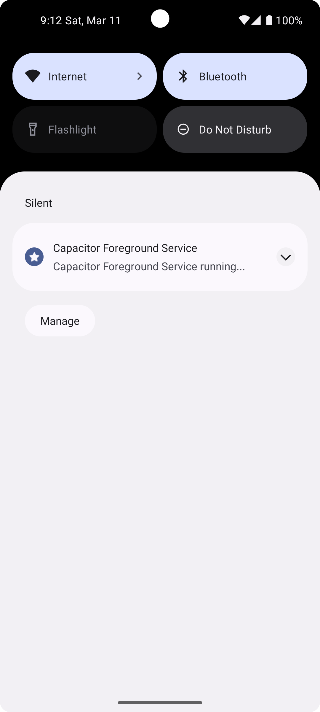

# Capacitor Foreground Service Plugin

## A simple foreground service manager

  
  

#### NOTICE: Using this plugin alone will not enable users to use JavaScript when an application is running in the background.

#### A second plugin that generates a background process to offer the program background cycles must be used in conjunction with this.

#### The primary purpose of this plugin is to address the issue mentioned above. If an app is not deemed a "foreground app" for Android API 26 or later, background processing will be prohibited, and background pluggins won't operate as intended.
### With the help of this plugin, your application will operate correctly in the background by becoming a forefront program.  This plugin could also be useful for Android Doze, which prevents applications from running in the background unless they are also running in the forefront.

  

### Compatible with android ApiVersions >= 26

  
  

## Usage

  


  

# Start service

Arguments:

```ts
interface  StartServiceOptions  {
     title:string, 
     description:string,
     icon?:string, // Custom icon path otherwise a Star icon is the default
     importance?:number,   //2: NotificationManager.IMPORTANCE_DEFAULT; 
						   //3: NotificationManager.IMPORTANCE_HIGH;
    					  //default: NotificationManager.IMPORTANCE_LOW;
     notificationId?:number // custom notificationId
     }
     
```
`//Call `
```js
CapacitorForegroundService.startService(options: StartServiceOptions);`

```
# Call
```ts
import {CapacitorForegroundService}  from  "capacitor-foreground-service";

CapacitorForegroundService.startService({title:"Foreground Service",description:"Foreground Service  running...."});

# Stop service

CapacitorForegroundService.stopService()
```

```

```

# TODO

- Custom Notification click action
